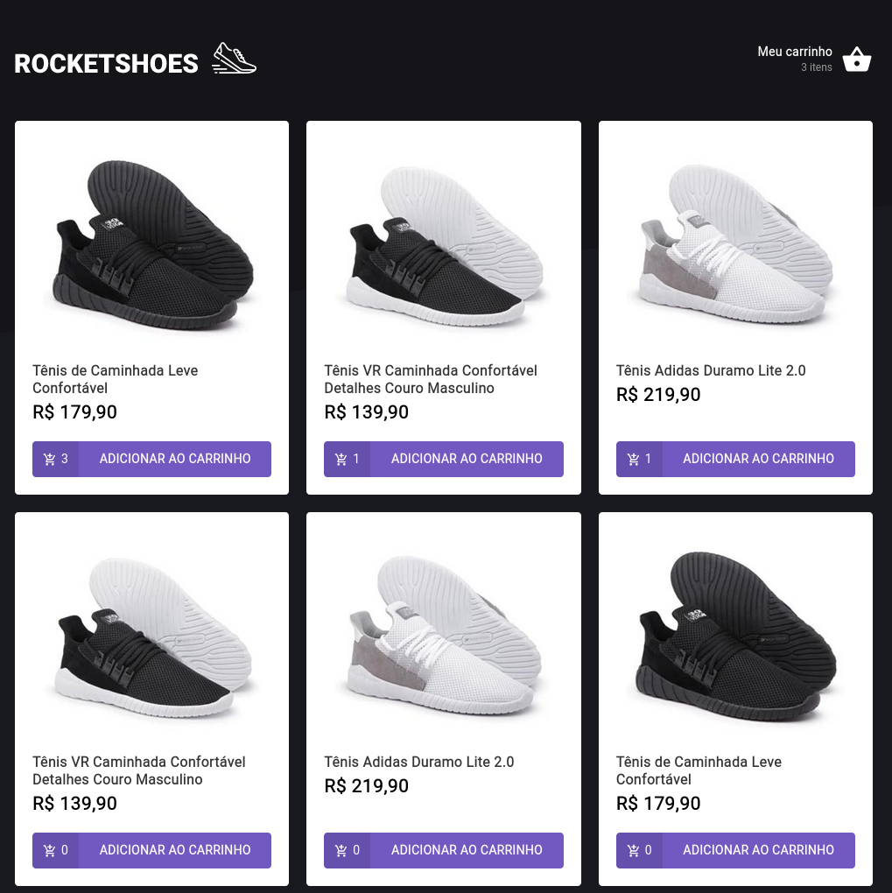
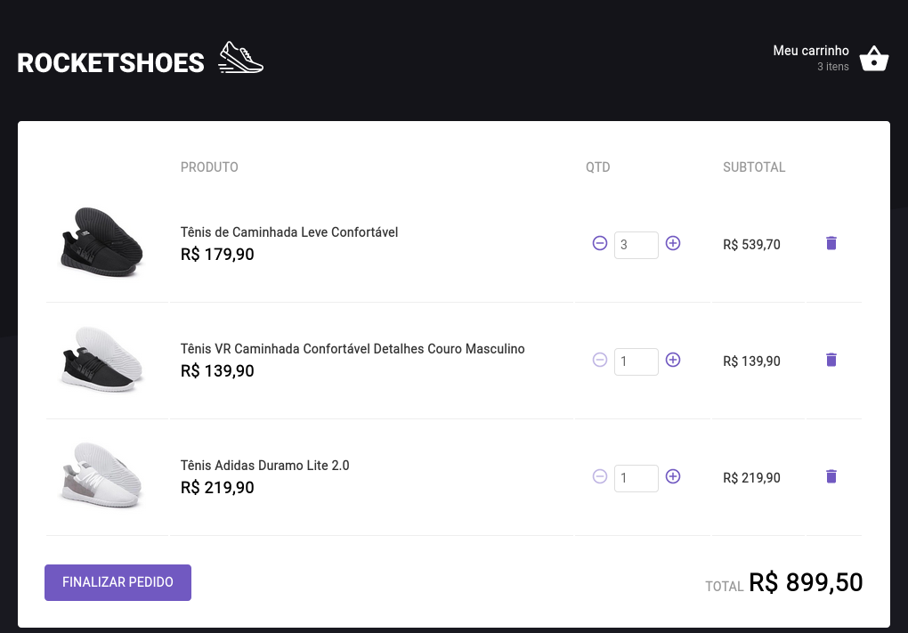

<p align="center" bg_color=rgba(0,0,0,0)>
  
</p>

## Dashboard


## Cart


### 🛠 Tecnologias
- [reactjs](https://pt-br.reactjs.org/)
- [TypeScript](https://www.typescriptlang.org/)
- [axios](https://axios-http.com/docs/intro)
- [polished](https://polished.js.org/)
- [styled-components](https://styled-components.com/)
- [react-toastify](https://fkhadra.github.io/react-toastify/introduction)
- [ContextAPI](https://pt-br.reactjs.org/docs/context.html)

## Como executar

```bash
# Instalar as dependências
- yarn

# Iniciar o projeto
- yarn start

```

O app estará disponível no seu navegador pelo endereço [http://localhost:3000](http://localhost:3000).
