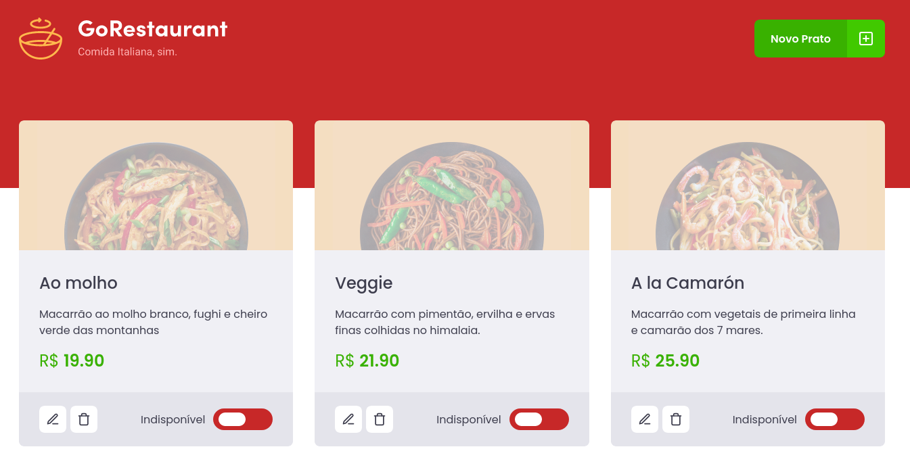
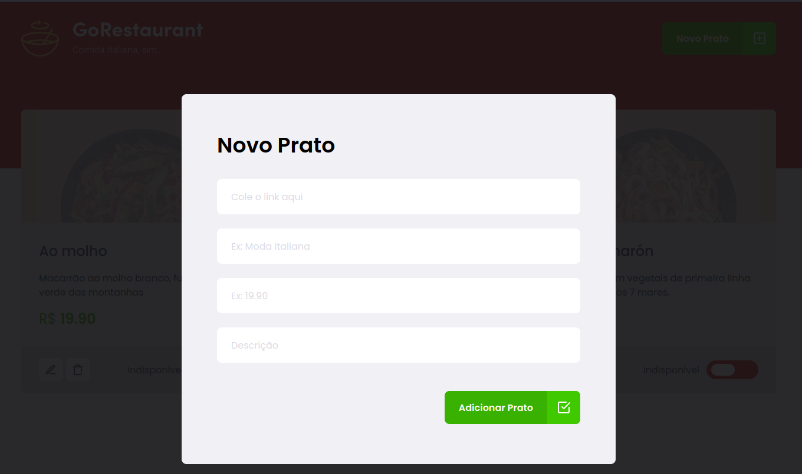

<p align="center">
  
  
</p>

## Dashboard


## Formulário


### 🛠 Tecnologias
- [reactjs](https://pt-br.reactjs.org/)
- [TypeScript](https://www.typescriptlang.org/)
- [axios](https://axios-http.com/docs/intro)
- [styled-components](https://styled-components.com/)

## Como executar

```bash
# Instalar as dependências
- yarn

# Iniciar o projeto
- yarn start

# Iniciar API
- yarn server
```

O app estará disponível no seu navegador pelo endereço [http://localhost:3000](http://localhost:3000).
